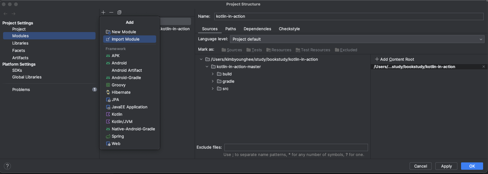

# kotlin-in-action
kotlin in action study repository

 

---

# 스터디 진행 방식

## 스터디 룰

- 분량은 1장을 기본으로 하며 모두 책을 읽었다는 전제로 가정합니다.
    
- 책을 읽다가 이해가 되지 않는 부분들은 깃허브 이슈 트래커에 등록합니다.
    
- 한 주당 리더 1명을 지정하여 진행합니다.
    
- 리더들은 1장에 대한 발표를 준비하고 매주 스터디 날에 발표를 진행합니다.
    
- 매주 스터디 날에 참석하여 발표와 이슈 트래커를 마무리합니다.
    
- 각 파트에는 서기가 있으며, 서기는 해당 날짜의 발표와 이슈에서 나온 내용을 정리하여 서류를 제출합니다.
    

## 스터디 멤버 역할

### 리더

- 매주 리더는 돌아가며 담당합니다. 발표를 준비합니다.
    
### 서기

- 차주 리더가 서기 역할을 맡습니다. 해당 주에 발표 내용을 정리하고, 이슈를 정리해서 모아놓은 자료를 작성합니다. 만약 다른 채널로 (예: 팀즈 등) 누락된 질문이 있다면, 이슈 트래커에 등록해줍니다.

### 멤버

- 책을 읽습니다. 이슈 트래커에 질문을 작성합니다.

--- 
코틀린 예제 파일 실행 방법
1. Project Structure에서 해당 파일을 Mudule(impoert)로 추가합니다.

