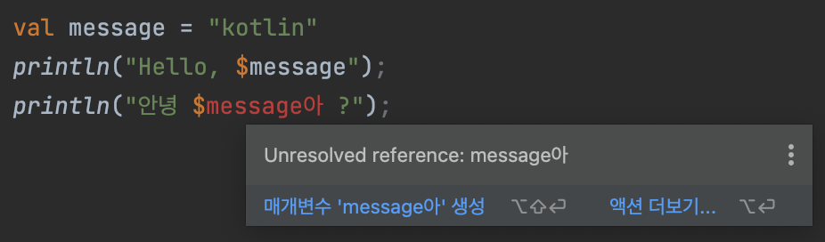

# [코틀린 인 액션] 2장 코틀린 기초

## 기본 요소
코틀린은 변경 가능한 데이터보다 **변경할 수 없는 불변 데이터 사용**을 장려합니다.

### 1. 코틀린 문법과 특성

```kotlin
fun main(args: Array<String>){
    println("Hello, world!")
}
```

- 함수를 선언할 때 fun 키워드를 사용합니다.
- 파라미터 이름 뒤에 그 파라미터의 타입을 씁니다.
- 함수를 최상위 수준에 정의할 수 있습니다.
- 배열 처리를 위한 문법이 존재하지 않습니다.
- 줄 끝에 세미콜론(;)을 붙이지 않아도 됩니다.

### 2. 함수

함수를 선언하는 방법을 학습합니다.

```kotlin
fun max(a: Int, b: Int): Int {
    return if (a > b) a else b
}
```


- 함수 선언은 fun 키워드로 시작합니다.
- fun 다음에는 함수 이름이 옵니다.
- 함수 이름 뒤 괄호 안에는 파라미터의 목록이 옵니다.
- 함수의 반환 타입은 파라미터 목록의 닫는 괄호 다음에 오는데, 괄호와 반환 타입은 콜론(:)으로 구분합니다.

위 코드를 보면 if는 **문장<sup>statement</sup>** 이 아니고 **식<sup>expression</sup>** 이라는 것을 확인할수 있습니다.  
코틀린에서는 루프를 제외한 대부분의 제어 구조가 **식**입니다.  
이렇게 제어 구조를 **식**으로 엮어낼 수 있으면 여러 일반적인 패턴을 아주 간결하게 표현할 수 있습니다.

```kotlin
// 식 expression
fun max(a: Int, b: Int): Int {
    return if (a > b) a else b
}
```

```java
// 문장 statement
class Example(){
    public int max (int a, int b) {
        if (a > b){
            return a;
        } else {
            return b;
        }
    }
}
```

반면 대입문은 자바에서는 **식**이었으나 코틀린에서는 **문장**이 되었습니다.  
그로인해 자바와 달리 대입식과 비교식을 잘못 바꿔써서 버그가 생기는 경우가 없습니다.

``` kotlin
val b = (a = 5)
```

위 식에서 `(a = 5)` 부분이 대입문을 식으로 사용하여 b 변수를 초기화하려고 하려는 시도입니다.   
코틀린에서는 컴파일 에러를 발생시킵니다. (자바에서는 가능합니다.)

> #### 프로그래밍 언어에서의 문<sup>statement</sup> 과 식<sup>expression</sup>
> **문<sup>statement</sup>**     | 어떤 작업을 수행하지만, 값을 생성하거나 반환하지 않는 코드 단위  
> **식<sup>expression</sup>**    | 어떤 작업을 수행하고 그 결과로 값을 생성하거나 반환하는 코드 단위

#### 식이 본문인 함수

위에서 본 함수 본문은 if식 하나로만 이루어져 있습니다.  
이런 경우 <u>중괄호와 return을 제거하고 등호(=)를 앞에 붙여서</u> 다음과 같이 간결하게 표현할 수 있습니다.

```kotlin
fun max (a: Int, b: Int): Int = if (a > b) a else b
```

> **블록이 본문인 함수**   | 본문이 중괄호로 둘러싸인 함수  
> **식이 본문인 함수**     | 등호와 식으로 이뤄진 함수 (*코틀린에서 자주 사용)  

**반환 타입**을 생략하면 더 간략하게 만들 수 있습니다.

```kotlin
fun max (a: Int, b: Int) = if (a > b) a else b
```

코틀린 컴파일러가 프로그래머 대신 프로그램 구성 요소의 타입을 정해주기 때문에 함수 반환 타입을 생략할 수 있습니다.  
이러한 기능을 **타입 추론<sup>type inference</sup>** 이라고 합니다. ***<u>식이 본문인 함수의 반환 타입만 생략이 가능합니다.</u>***

### 3. 변수

코틀린에서는 키워드로 변수 선언을 시작하는 대신 변수 이름 뒤에 타입을 명시하거나 생략하게 허용합니다.

```kotlin
val question = "삶, 우주, 그리고 모든 것에 대한 궁극적인 질문"
val answer = 42
```

위 예제는 타입 표기를 생략하였지만 원한다면 타입을 명시해도 됩니다.

```kotlin
val answer: Int = 42
```

식이 본문인 함수에서와 마찬가지로 타입을 지정하지 않으면 컴파일러가 초기화 식을 분석해서 타입을 지정합니다.  
초기화 식이 없다면 변수에 저장될 값을 모르기 때문에 컴파일러가 타입을 추론할 수 없습니다.

#### 변수의 종류
- **val(value)** | 선언할 데이터의 값이 **변경되지 않을 경우**에 사용합니다. java의 final 특성과 같습니다.
- **var(variable)** | 선언할 데이터의 값이 변경될 수 있을 경우 사용합니다. java의 일반 변수의 특성과 같습니다.
- **const** | 상수, 한 번 초기화 하면 내부의 값을 사용할 수는 있지만, 바꿀 수는 없는 경우 사용합니다. val과 같은 특성이지만 불변성의 차이가 존재합니다. java의 static final 특성과 같습니다. val 앞에 const 키워드를 붙여서 사용합니다.

#### val의 특성

한 번만 초기화할 수 있는데, 컴파일러가 문맥을 살펴봤을 때 한 번만 초기화 되는 것이 맞으면 상황에 따라 val을 여러 값으로 초기화할 수 있습니다.

```kotlin
fun example(){
    val name: String

    if(isName()){
        name = "홍길동"
    } else {
        name = "임꺽정"
    }
}
```

val은 변경이 불가능하지만 val이 가르키는 객체의 내부값은 변경할 수 있습니다.

```kotlin
fun main(args: Array<String>){
	val myArray = arrayListOf("java")
	myArray.add("Kotlin")
}
```

#### var의 특성

var는 값을 변경할 수 있지만 선언시 사용한 타입으로만 변경할 수 있습니다.

```kotlin
fun example(){
    var name = "홍길동"
    // name = 22 => 불가능
}
```

#### :star: val과 const val의 차이점

- val | 불완전한 불변성 
  - 값이 **런타임**시에 결정되는 상수입니다.
  - 독립적인 프로그램 수행 중에 프로그램 수행에 따라 값이 바뀔 수 있습니다..
  - 두 숫자를 더한 값을 반환하는 함수를 사용해서 val의 값을 정한다고 했을 때, 이 값은 함수의 parameter로 들어가는 숫자에 따라 언제든지 달라질 수 있습니다.

```kotlin
fun main(args: Array<String>){
	val num = sumExam(40, 20)
	println(num)
}

fun sumExam(a: Int, b: Int) = a + b
```

- const val | 불변성 
  - 값이 **컴파일**시에 결정되는 상수입니다.
  - 클래스의 생성자에 할당될 수 없으며, String을 포함한 기본 자료형으로만 선언할 수 있습니다.
  - 함수 내의 지역변수나 클래스의 속성으로 사용할 수 없습니다.
  - const val을 함수나 클래스 내에서 사용하려면 companion object 이하 중괄호안에 선언해야합니다.
  - 이렇게 선언된 const val은 함수나 클래스의 상태에 상관없이 언제나 동일한 값을 가져야합니다.
  - 이름을 결정할 때 일반적인 변수와 달리 **대문자**와 **_** 를 사용합니다.
  - const val의 경우 컴파일 시에 데이터가 메모리에 존재하기 때문에, 사용시 객체를 생성해서 이에 접근하는 것이 아니고 **클래스명.상수명**의 형태를 사용해서 직접 접근합니다.
  - 클래스의 객체를 생성한 뒤 사용해야 하는 클래스 속성의 소요시간을 줄여서 성능을 향상할 수 있습니다.

```kotlin
fun main(args: Array<String>){
	println(ExamClass.CONST_VAL)
}

class ExamClass(){
	companion object{
		const val CONST_VAL = 100
	}
}
```

기본적으로는 **모든 변수를 val 키워드를 사용해 불변 변수로 선언**하고, 나중에 꼭 **필요할 때만 var로 변경**하는 것을 권장합니다.

### 4. 문자열 템플릿

```kotlin
fun main(args: Array<String>) {
    val name = if (args.isNotEmpty()) args[0] else "Kotlin"
    println("Hello, $name!")
}
```

이 코드는 `name` 이라는 변수를 선언하고 그 다음 줄에 있는 문자열 리터럴 안에서 그 변수를 사용했습니다.  
물론 컴파일러는 각 식을 정적으로 검사하기 때문에 존재하지 않는 변수를 문자열 템플릿 안에 사용하면 컴파일 오류가 발생합니다.  
$ 문자를 문자열에 넣고 싶으면 `println("\$")` 와 같이 \(백슬레시)를 사용하여 $를 이스케이프<sup>escape</sup>시켜야 합니다.

> **한글을 문자열 템플릿에서 사용할 경우 주의할 점**  
> 문자열 템플릿 안에 $로 변수를 지정할 때 변수면 바로 뒤에 한글을 붙여서 사용하면 코틀린 컴파일러는 영문자와 한글을 한꺼번에 식별자로 인식해서 unresolved reference 오류를 발생시킵니다.  
> 
> 이 오류의 해결방법은 `${name}` 처럼 변수 이름을 {}로 감싸는 것 입니다. 문자열 템플릿 안에서 변수 이름만 사용하는 경우라도 `${name}`처럼 중괄호로 변수명을 감싸는 습관을 들이면 더 좋습니다.

---

## 클래스와 프로퍼티

이번 절은 클래스를 선언하는 기본 문법을 소개합니다.

```java
public class Person {
    private final String name;
    
    public Person(String name){
        this.name = name;
    }
    
    public String getName(){
        return name;
    }
}
```

위 소스는 자바로된 Person 클래스입니다.  
필드가 늘어날 수록 생성자인 Person(String name)의 본문의 코드도 늘어납니다.
자바에서는 생성자 본문에 이 같은 코드가 반복적으로 들어가는 경우가 많습니다.
<u>코틀린에서는 그런 필드 대입 로직을 훨씬 더 적은 코드로 작성할 수 있습니다.</u>

```kotlin
class Person(val name: String)
```

이런 유형의 클래스를 **값 객체<sup>value object</sup>** 라 부릅니다.

### 1. 프로퍼티

클래스라는 개념의 목적은 데이터를 **캡슐화<sup>encapsulate</sup>** 하고 캡슐화한 데이터를 다루는 코드를 한 주체 안에 두는 것 입니다.

자바에서는 데이터를 필드에 저장하며, 필드의 가시성은 보통 private입니다.
클래스는 접근자 메서드<sup>accessor method</sup>를 이용하여 데이터의 접근을 허용합니다.
자바에서는 필드와 접근자를 한데 묶어 프로퍼티<sup>property</sup>라고 부릅니다.

코틀린은 프로퍼티를 언어 기본 기능으로 제공하며, 코틀린 프로퍼티는 자바의 필드와 접근자 메서드를 완전히 대신합니다.
클래스에서 프로퍼티를 선언할 때는 val이나 var을 사용합니다.
***val은 프로퍼티는 읽기 전용이며, var 프로퍼티는 변경 가능합니다.***

```kotlin
class Person (
    val name: String,
    val isMarried: Boolean
)
```

기본적으로 코틀린에서 프로퍼티를 선언하는 방식은 프로퍼티와 관련 있는 접근자를 선언하는 것 입니다.
코틀린은 setter, getter로 이루어진 간단한 디폴트 접근자 구현을 제공합니다.

```kotlin
class Person {
  val name: String
  val isMarried: Boolean
}

fun main(args: Array<String>){
  // new 키워드를 사용하지 않고 생성자를 호출
  val person = Person("Bob", false)
  
  // 코틀린이 자동으로 getter를 호출
  println(person.name)
  println(person.isMarried)
  
  // 코틀린이 자동으로 setter를 호출
  person.isMarried = true

  println(person.isMarried)
}
```

### 2. 커스텀 접근자