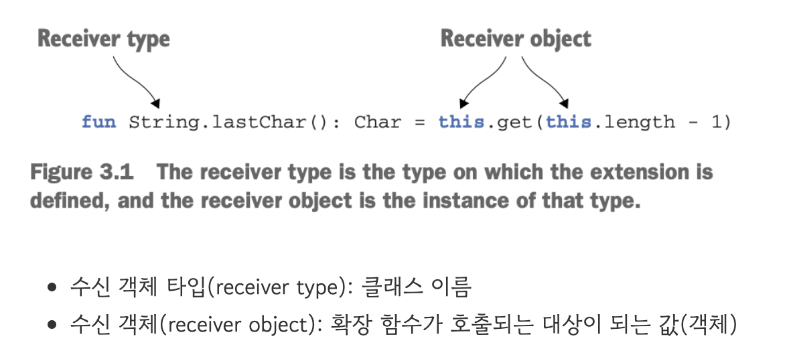
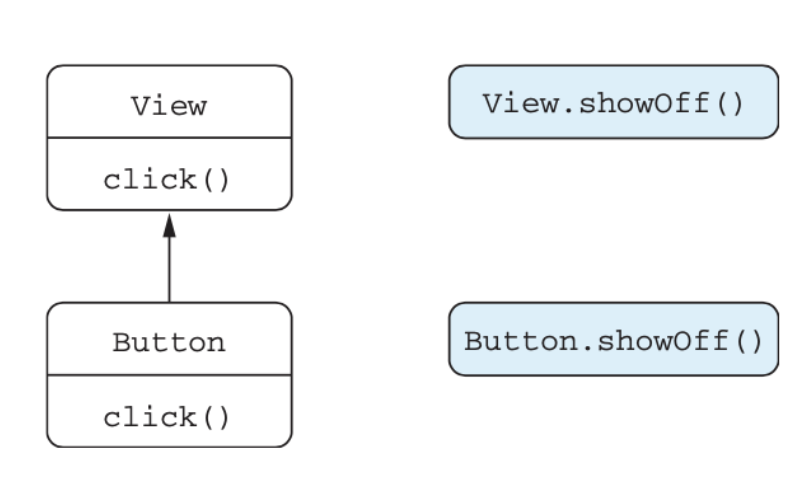
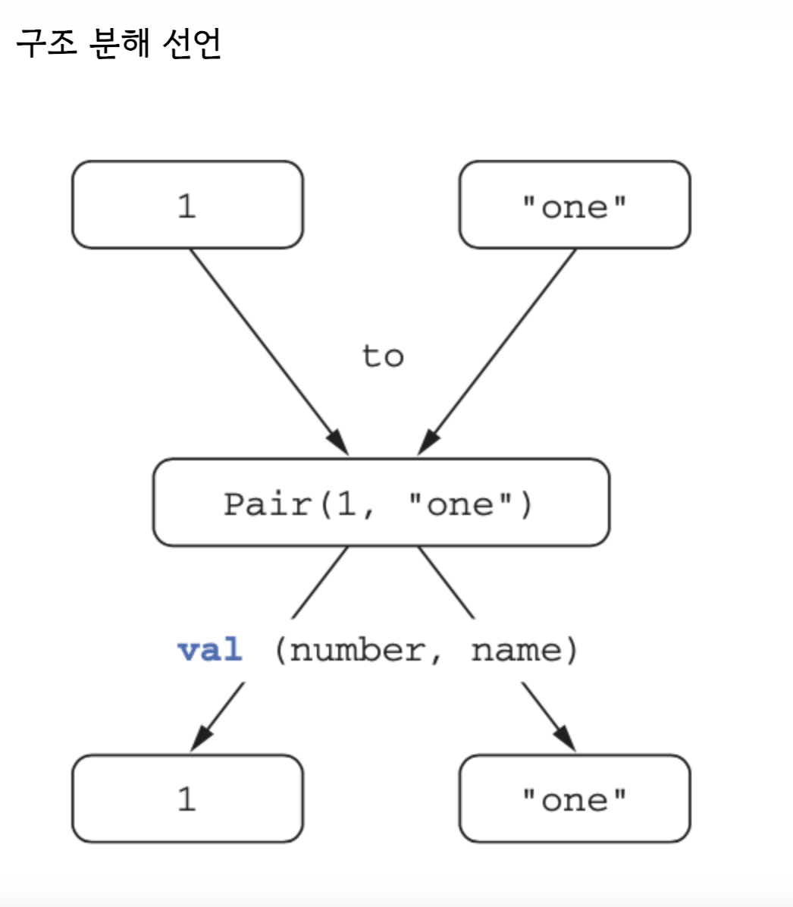

#[코틀린 인 액션 ] 3장. 함수 정의와 호출

## 다룰 내용
- 컬렉션, 문자열, 정규식을 다루기 위한 함수
- 이름 붙인 인자, 디퐅르 파라미터 값, 중위 호출 문법 사용
- 확장 함수와 확장 프로퍼티를 사용해 자바 라이브러리 적용
- 최상위 및 로컬 함수와 프로퍼티를 사용해 코드 구조화

<br>

### 1. 코틀린에서 컬렉션 만들기

<u>코틀린에서 사용하는 컬렉션은 자바보다 대체적으로 편리하게 사용 가능하다</u>

```java
import java.util.HashSet;
import java.util.ArrayList;
import java.util.HashMap;
import java.util.Arrays;

public class Main {
	public static void main(String[] args) {
	    
            //HashSet
            HashSet<Integer> set = new HashSet<>();
            set.add(1);
            set.add(2);
            
            //ArrayList
            ArrayList<Integer> list = new ArrayList<>();
            list.add(1);
            list.add(2);
            list.add(53);
            
            //HashMap
            HashMap<Integer, String> map = new HashMap<>();
            map.put(1, "one");
            map.put(7, "kt");
            map.put(53, "fifty-three");
    
            // 결과 출력
            System.out.println("자바 결과값 set: " + set);
            System.out.println("자바 결과값 list: " + list);
            System.out.println("자바 결과값 map: " + map);
	}
}
```

코틀린에서는 Import 같은 자바 표준 라이브러리 클래스들을 자동으로 지원하므로 생략가능
```kotlin
val set3 = hashSetOf(1, 1, 53)
val list3 = arrayListOf(1, 1, 53)
val map3 = hashMapOf(1 to "one", 7 to "one", 53 to "fifty-three")
```
여기서 to는 코틀린에서 제공하는 표준 라이브러리 함수이며 뜻하는 바는 1 to one 
1이라는 키와 one 이라는 값을 가진 쌍을 나타낼때 사용한다<br><br>


<u>코틀린은 자신만의 컬렉션 기능을 제공하지 않는다.</u>

```kotlin
val set3 = hashSetOf(1, 1, 53)
val list3 = arrayListOf(1, 1, 53)
val map3 = hashMapOf(1 to "one", 7 to "one", 53 to "fifty-three")
```

위의 코틀린 컬렉션을 클래스로 변환해보면 다음과 같이 뜨는데

```kotlin
println(set3.javaClass) // class java.util.HashSet
println(list3.javaClass) // class java.util.ArrayList
println(map3.javaClass) // class java.util.HashMap
```

코틀린은 고유의 컬렉션을 쓰지않고 자바의 컬렉션을 그대로 가져다 활용하는 것을 볼수있다.
(참조 : study_3_1 심화 학습)<br><br><br>


## 2. 함수를 호출하기 쉽게 만들기


- 코틀린은 함수에 전달하는 인자 중 일부의 이름을 명시 할 수 있다.

```kotlin
println(joinToString1(list, separator=";", prefix="(", postfix=")"));
```

- 코틀린은 디폴트 파라메터 값을 명시하여 오버로딩을 최소화 할 수 있다.

```kotlin
fun <T> joinToString2(
    collection: Collection<T>,
    separator: String = ", ",
    prefix: String= "",
    postfix: String = ""
): String {

    val result = StringBuilder(prefix)

    for ((index, element) in collection.withIndex()) {
        if (index > 0) result.append(separator)
        result.append(element)
    }

    result.append(postfix)
    return result.toString()
}

fun main() {
    println(joinToString2(list, separator = ";", prefix = "(", postfix = ")"))
    println(joinToString2(list, separator = ";", prefix = "("));
    println(joinToString2(list, separator = ";"));
}
```

- 불필요한 유틸리티 클래스를 쓰지않고 최상위 함수로 특정기능을 수행 할 수 있다.


[ 자바 유틸리티 클래스 ]
```Java
package ch03.study.study_3_2;

final class MathUtil {

    // Private 생성자를 추가하여 외부 인스턴스화 방지
    private MathUtil() {
        throw new AssertionError("No MathUtils instances for you!");
    }

    // 정적 유틸리티 메서드
    public static int add(int a, int b) {
        return a + b;
    }
}
```
[코틀린 유틸리티 함수]

```kotlin
/* 코틀린 */
@file:JvmName("MathFunctions")
package Maths

fun add(a:Int,b:Int):Int{
    return a+b;
}
```


## 3. 유틸리티 확장 함수와 확장 프로퍼티




- 코틀린은 위의 형식을 이용해 보다 간편하게 함수를 확장해 나갈 수 있다.

[유틸리티+확장 함수]
```kotlin 확장함수
@file:JvmName("StringFunctions")
package strings

fun String.lastChar2():Char {
    return this.get(this.length-1);
}

fun String.frist():Char {
    return this.get(0);
}

fun String.substr():String {
    return this.substring(1,3);
}

fun String.second():Char = this.substr().get(1);
```

[코틀린 코드]

```kotlin
import strings.*

fun main() {
    println("kotlin".substr().frist())
    println("kotlin".second())
}
```

- 유틸리티 함수를 다른 이름으로 활용 가능하다


```kotlin
import strings.frist as fristNum

fun main() {
    println("Kotlin".fristNum());//임포트한 함수를 다른 이름으로 부를 수 있다.
}
```

- 유틸리티 함수내에 프로퍼티를 활용해서 데이터를 관리 할 수 있다.

[유틸리티 함수]

```유틸리티 확장함수
@file:JvmName("MathFunctions")
package Maths

var multiplication = 1; //최상위 프로퍼티 사용

fun reportOperationCount(){ //정적 필드로 시스템이 초기화 될때까지 메모리에 남김
    multiplication++;
    println("Operation performed $multiplication times")
}
```


```kotlin
import Maths.*;

fun main(){
    /* 유틸리티 함수 내에 정적 필드로 시스템이 초기화 될때까지 메모리에 남겨 활용 */
    reportOperationCount();
    println(MathFunctions.multiplication);
}
```


- 코틀린의 확장 함수는 오버라이드 할 수 없다.

```kotlin
/* 클래스의 오버라이드 */
val view: View = Button()
view.click(); // Button Clicked


/* 확장함수 오버라이딩 불가 */
open class View {
    open fun click() = println("View clicked")
}

class Button: View() {//View 클래스를 상속받는 Button 클래스
    override fun click() = println("Button clicked")
}

fun main(){
    val view: View = Button()
    view.click(); // Button Clicked
    
    fun View.showOff() = println("I'm a View!")
    fun Button.showOff() = println("I'm a button!");

    val function: View = Button()
    function.showOff(); // I'm a View!
}
```

확장 함수는 클래스 밖에 선언 되기 때문에 오버라이딩 되지 않는다



- 코틀린은 확장 프로퍼티를 제공해 데이터 관리를 보다 간편하게 활용 가능하다

```kotlin
/* 확장 프로퍼티 선언 */
val String.lastChar:Char get() = get(length -1);

/* 변경 가능한 확장 프로퍼티 선언 */
var StringBuilder.lastChar:Char get() = get(length -1);
    set(value:Char) {
        this.setCharAt(length -1, value);
}

fun main(args: Array<String>) {
    println("Kotlin".lastChar)
    val sb = StringBuilder("Kotlin?")
    sb.lastChar = '!'
    println(sb)
}
```

## 4. 컬렉션 처리:가변 길이 인자, 중위 함수 호출, 라이브러리 지원

- 코틀린은 자바 컬렉션에서 더 많은 컬랙션 기능을 제공 한다

```kotlin
//마지막 원소를 반환
val String = listOf("frist","second","fourteenth");
println(String.last()); //Array 컬렉션에서 더 많은 기능을 코틀린에서 제공

//최대값 찾기
val number = setOf(1,14,2)
println(number.max());  //HashSet 컬렉션에서 더 많은 기능을 코틀린에서 제공
```
자바 라이브러리 클래스의 인스턴스인 컬렉션에 대해 코틀린이 새로운 기능을 쉽게 추가 할 수 있었던 이유는
확장 함수의 개념 때문 

 <u>자바의 유틸리티의 클래스 함수를 가져다가 코틀린 확장 함수형태로 변환해 새로운 메소드 형태를 만든것</u>

- 코틀린은 인자의 개수가 달라질 수 있는 함수의 정의가 쉽다

[자바]

```
ArrayList<Integer> list = new ArrayList<>();
list.add(1);
list.add(2);
list.add(53);

HashSet<Integer> set = new HashSet<>();
set.add(1);
set.add(2);
```

[ 코틀린 ] 
```kotlin
//리스트의 생성이 자바에 비해 비교적 쉽다.

//List에 원하는 만큼의 원소를 전달 가능
val arrayList = listOf(2,3,4,5,6); 
println(arrayList);

// *args 연산자를 써 앞에 전달하려고 하는 내용을 리스트에 원소를 전달
val list = listOf("args: ", *args) 
println(list)
```

- 코틀린은 중위 호출과 구조 분해 선언이 가능하다

인자가 하나뿐인 메서드나 확장 함수에 중위 호출을 사용할 수 있다.

수신 객체와 유일한 메서드 인자 사이에 메서드 이름을 넣어 호출한다.

infix를 함수 선언 앞에 붙여서, 중위 호출을 허용할 수 있다.


```kotlin
infix fun Any.to(other: Any) = Pair(this, other)

fun main(args: Array<String>) {
    val map3 = hashMapOf(1 to "one", 7 to "one", 53 to "fifty-three")
}
```

[중위 표현]
```
infix fun Int.add(other:Int):Int{
    return (this + other)
}

fun main(args: Array<String>){
  val sum = 5 add 10
  system.out.println(sum)//15
}
```




[루프를 써서 구조분해]
```
for ((index, element) in collection.withIndex()) {
    println("$index: $element")
}
```

[중위 함수를 써서 구조분해]
```
val (number, name) = 1 to "one" //두 변수를 즉시 초기화할 수 있다.
```


구조분해(간편 예제)

```kotlin
//operator: 키워드는 특정 연산자를 지원하는 함수로 지정하는 데 사용
class MyData(val a: Int, val b: String, val c: Double) {
    operator fun component1(): Int = a
    operator fun component2(): String = b
    operator fun component3(): Double = c
}

fun main() {// 구조 분해 선언
    val myData = MyData(1, "test", 3.14)//클래스를 생성함과 동시에
    val (x, y, z) = myData//operator 선언한 componentN 함수를 각각 호출해서 각각의 변수에 넣어줌
}
```

## 5. 문자열과 정규식 다루기

코틀린은 자바에 비해 문자열을 다루는데 더 많은 기능을 제공

 - 코틀린은 자바에 비해 문자열을 나누기가 더욱더 편리하다.

[ 자바 ]
```
String input = "12.345-6.A";

String[] ex1 = input.split("\\.");
   for(String part : ex1) {
       //result:[12,345,6,A]
       System.out.println(part); 
}
```

[ 코틀린 ]
```kotlin
println("12.345-6.A".split("\\.|-".toRegex()))
```

간단한 경우에는 꼭 정규식을 쓸 필요가 없다. split 확장 함수를 오버로딩한 버전 중에는 구분 문자열을 하나 이상 인자로 받는 함수가 있다.

[ 자바 ]
```
구분 문자(.)는 자바에서 split으로 문자열을 나눌수없다
     
String input = "12.345-6.A";
String[] ex1 = input.split("\\.|\\-");
  
  for(String part : ex1) {
      System.out.println(part); //12.345-6.A
      
}
```

[ 코틀린 ]

```kotlin
println("12.345-6.A".split(".","-")) // 여러 구분 문자열을 지정한다.
```

###정규식과 3중 따옴표로 묶은 문자열

- 코틀린에서는 정규식을 쓰지 않고 문자열을 쉽게 파싱할 수 있다.

[String을 통한 확장 함수]
```kotlin
/* 파일의 전체 경로명을 디렉터리, 파일이름, 확장자로 구분 하는 코드 */

fun parsePath(path: String) {
    val directory = path.substringBeforeLast("/")
    val fullName = path.substringAfterLast("/")

    val fileName = fullName.substringBeforeLast(".")
    val extension = fullName.substringAfterLast(".")

    println("Dir: $directory, name: $fileName, ext: $extension")
}

fun main(args: Array<String>) {
    parsePath("/Users/yole/kotlin-book/chapter.adoc")
}

// result
// Dir: /Users/yole/kotlin-book, name: chapter, ext: adoc
```

- 코틀린의 정규식은 자바의 정규식보다 더욱더 알아보기 쉽고 정교한 활용이 가능하다 


```kotlin
fun parsePath(path: String) {
val regex = """(.+)/(.+)\.(.+)""".toRegex()
val matchResult = regex.matchEntire(path)
    
    if (matchResult != null) {
        val (directory, filename, extension) = matchResult.destructured
        println("Dir: $directory, name: $filename, ext: $extension")
    }
}

fun main(args: Array<String>) {
    parsePath("/Users/yole/kotlin-book/chapter.adoc")
}
```
3중 따옴표 안에서는 역슬래시를 포함한 어떤 문자도 이스케이프할 필요가 없다.
줄바꿈을 표현하는 아무 문자열이나 그대로 들어간다.


### 6.코드 다듬기

코틀린은 중복 코드를 깔끔하게 다듬을수 있다.

[검증로직] - (자바식)방법

```kotlin
class User(val id: Int, val name: String, val address: String, val phoneNumber:String, val gender:String)

fun saveUser(user: User) {
    if (user.name.isEmpty()) {
        throw IllegalArgumentException(
            "Can't save user ${user.id}: empty Name")
    }

    if (user.address.isEmpty()) {
        throw IllegalArgumentException(
            "Can't save user ${user.id}: empty Address")
    }
    if (user.phoneNumber.isEmpty()) {
        throw IllegalArgumentException(
            "Can't save user ${user.id}: empty Address")
    }

    if (user.gender.isEmpty()) {
        throw IllegalArgumentException(
            "Can't save user ${user.id}: empty Address")
    }
}
fun main(args: Array<String>) {
    saveUser(User(1, "", "" ,"" ,""))
}
```

[검증로직] - 코틀린(로컬함수)로 개선

```
class User(val id: Int, val name: String, val address: String , val phoneNumber:String, val gender:String)

fun saveUser(user: User) {

    fun validate(user: User,
                 value: String,
                 fieldName: String) {
        if (value.isEmpty()) {
            throw IllegalArgumentException(
                "Can't save user ${user.id}: empty $fieldName")
        }
    }

    validate(user, user.name, "Name")
    validate(user, user.address, "Address")
    validate(user, user.phoneNumber, "phoneNumber")
    validate(user, user.gender, "gender")
    
}
fun main(args: Array<String>) {
    saveUser(User(1, "", "" ,"" ,""))
}
```

[검증로직] - 코틀린(로컬함수) 바깥 파라메터 참조 

```kotlin
class User(val id: Int, val name: String, val address: String,val phoneNumber:String, val gender:String)

fun saveUser(user: User) {
    fun validate(value: String, fieldName: String) {
        if (value.isEmpty()) {
            throw IllegalArgumentException(
                "Can't save user ${user.id}: " +
                        "empty $fieldName")
        }
    }

    validate(user.name, "Name")
    validate(user.address, "Address")
    validate(user.phoneNumber, "phoneNumber")
    validate(user.gender, "gender")

    // Save user to the database
}

fun main(args: Array<String>) {
    saveUser(User(1, "", "" ,"" ,""))
}
```

[검증로직] - 로컬함수와 확장함수로 개선

```kotlin
class User(val id: Int, val name: String, val address: String, val phoneNumber:String, val gender:String)

fun User.validateBeforeSave() {
    fun validate(value: String, fieldName: String) {
        if (value.isEmpty()) {
            throw IllegalArgumentException(
                "Can't save user $id: empty $fieldName")
        }
    }

    validate(name, "Name")
    validate(address, "Address")
    validate(phoneNumber, "phoneNumber")
    validate(gender, "gender")
}

fun saveUser(user: User) {
    user.validateBeforeSave()
}

fun main(args: Array<String>) {
    saveUser(User(1, "", "" ,"" ,""))
}
```


