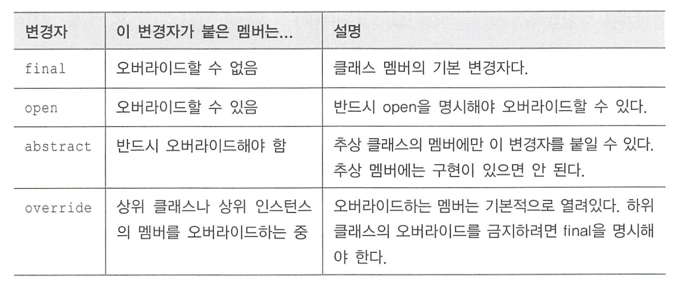
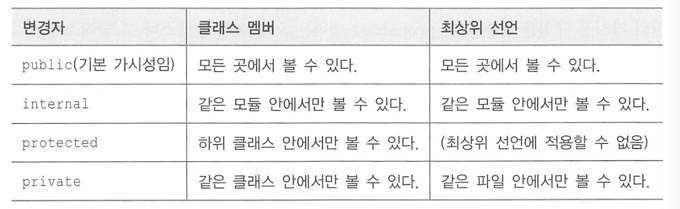
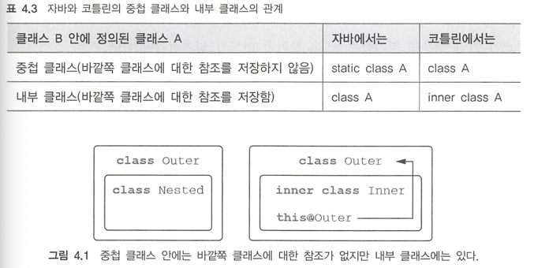

# [코틀린 인 액션] 4장. 클래스, 객체, 인터폐이스

## 클래스 계층 정의
### 코틀린 인터페이스
```kotlin
interface Clickable {
    fun click()
}
```
- 인터페이스를 선언할때는 `interface`를 사용한다.

```kotlin
class Button : Clickable {
    override fun click() = println("I was clicked")
}
```
- 클래스 이름에 콜론(:)을 붙이고 인터페이스와 클래스이 이름을 적는 것으로 클래스 확장과 인터페이스 구현을 모두 처리한다.
- `override` 변경자는 상위 클래스나 상위 인터페이스에 있는 프로퍼티나 메서드를 오버라이드한다는 표시이다.
- 코틀린에서는 `override` 변경자를 꼭 사용해야한다.

<br>

#### 동일한 메서드를 구현하는 다른 인터페이스 정의
```kotlin
class Button : Clickable, Focusable {
    override fun click() = println("I was clicked")

    override fun showOff() {
        super<Clickable>.showOff()
        super<Focusable>.showOff()
    }
}

interface Clickable {
    fun click()
    fun showOff() = println("I'm clickable!")
}

interface Focusable {
    fun setFocus(b: Boolean) =
        println("I ${if (b) "got" else "lost"} focus.")

    fun showOff() = println("I'm focusable!")
}
```
- 한 클래스에서 두 인터페이스를 함께 구현할 때, 클래스가 구현하는 두 상위 인터페이스에 정의된 `showOff` 구현을 대체할 오버라이딩 메서드를 직접 제공하지 않으면 컴파일러 오류가 발생한다.
- `Button`은 상속한 두 상위 타입의 `showOff()` 메서드를 호출하는 방식으로 `showOff()`를 구현한다.
- 코틀린에서 상위 타입 구현을 호출할 때는 `super<Clickable>.showOff()` 처럼 꺾쇠 갈호 안에 기반 타입 이름을 지정한다.

### open, final, abstract 변경자 : 기본적으로 final
- 코틀린은 `취약한 기반 클래스 문제`를 해결하기 위해 클래스와 메스드가 기본적으로 final로 되어있다.
> **취약한 기반 클래스 문제** | 하위 클래스가 기반 클래스에 대해 가졌던 가정이 기반 클래스를 변경함으로써 깨져버린 경우에 생기는 문제를 뜻한다.

```kotlin
open class RichButton : Clickable {

    fun disable() {}

    open fun animate() {}

    final override fun click() {}
}
```
- 어떤 클래스의 상속을 허용하려면 클래스 앞에 `open` 변경자를 붙여야 한다.
- 오버라이드를 허용하고 싶은 메서드나 프로퍼티의 앞에도 `open` 변경자를 붙여야한다.
- 기반 클래스나 인터페이스의 멤버를 오버라이드하는 경우 그 메서드는 기본적으로 열려있기 때문에, 오버라이드하는 메서드의 구현을 하위 클래스에서 오버라이드하지 못하게 금지하려면 오버라이드하는 메서드 앞에 `final`을 명시해야한다.

```kotlin
abstract class Animated {
    abstract fun animate()
    open fun stopAnimating(){}
    fun animateTwice(){ }
}
```
- 추상 멤버는 항상 열려있기 때문에 추상 멤버 앞에 `open` 변경자를 명시할 필요가 없다.
- 추상 클래스에 속했더라도 비추상 함수는 기본적으로 `final` 이지만 원한다면 `open`으로 오버라이드를 허용할 수 있다.




### 가시성 변경자 : 기본적으로 공개

- 자바와 비슷하게 public, protected, private 변경자가 있다.
- 코틀린에서는 모듈 내부에서만 사용할 수 있는 `internal` 접근자를 따로 제공한다.
> **모듈** | 한꺼번에 컴파일되는 코틀린 파일들을 의미한다.


### 내부 클래스와 중첩된 클래스 : 기본적으로 중첩 클래스
> **중첩 클래스** | 형태만 내부에 존재할 뿐 실질적으로는 내용을 서로 공유할 수 없는 별개의 클래스 <br><br>
> **내부 클래스** | 외부 클래스 객체 안에서 사용되는 클래스이므로 외부 클래스 객체의 속성이나 함수를 사용 할 수 있다.
- 자바에서는 A 킅래스 안에 B 클래스를 정의하면 B 클래스는 자동으로 내부 클래스가 되지만 코틀린에서는 중첩클래스가 된다.
- 코틀린에서 내부 클래스로 만들고 싶으면 `inner` 키워드로 클래스를 선언해야한다.



<br>

```kotlin
interface State: Serializable //Serializable 인터페이스 구현
interface View { //
    fun getCurrentState(): State //State 리턴자를 가지는 getCurrentState
    fun restoreState(state: State) {} //State 매개변수를 가지는 restoreState
}
```
- View 인터페이스 안에는 뷰의 상태를 가져와 저장할 때 getCurrentState와 restoreState 메소드 선언이 있다.


<br>
[JAVA]

```java
public class Button implements View {
    @Override
    public State getCurrentState() {
        return new ButtonState();
    }

    @Override
    public void restoreState(State state) { /*...*/ }
    public class ButtonState implements State { /*...*/ }
}
```
- `java.io.NotSerializableException: Button`라는 오류가 발생한다. 
> **직렬화하려는 변수는 ButtonState 타입의 state 였는데 Button을 직렬화할 수 없다는 예외가 발생하는 이유 ?** <br>
> - 이 예제의 ButtonState 클래스는 바깥쪽 Button 클래스에 대한 참조를 묵시적으로 포함한다. 
> - 그 참조로 인해 ButtonState를 직렬화할 수 없다. Button을 직렬화할 수 없으므로 버튼에 대한 참조가 ButtonState의 직렬화를 방해한다.
> - 이 문제를 해결하려면 ButtonState를 `static` 클래스로 선언하여 묵시적인 참조가 사라지게 해야한다.


<br>

[Kotlin]

```kotlin
//코틀린의 중첩 클래스
class Button : View {
    override fun getCurrentState(): State = ButtonState()
    override fun restoreState(state: State) { /*...*/ }
    class ButtonState : State { /*...*/ }
}
```
- 코틀린 중첩 클래스에 아무런 변경자가 붙지 않으면 자바 `static` 중첩 클래스와 같기 때문에 오류가 나지 않는다.
 
<br>

```kotlin
class Outer {
    inner class Inner {
        fun getOuterReference(): Outer = this@Outer
    }
}
```
- 내부 클래스로 변경해서 바깥쪽 클래스에 대한 참조를 포함하게 만들고 싶다면 `inner` 변경자를 붙여야 한다.
- 코틀린에서 바깥쪽 클래스의 인스턴스를 가르키려면 내부 클래스 Inner 안에서 `this@Outer`라고 써야 한다.

<br>

### 봉인된 클래스: 클래스 계층 정의 시 계층 확장 제한
```kotlin
interface Expr
class Num(val value: Int) : Expr
class Sum(val left: Expr, val right: Expr) : Expr

fun eval(e: Expr): Int =
    when (e) {
        is Num -> e.value
        is Sum -> eval(e.right) + eval(e.left)
        else -> // "else" 분기가 꼭 있어야 한다. 
            throw IllegalArgumentException("Unknown expression")
    }
```
- when 식에서 Num과 Sum이 아닌 경우를 처리하는 else 분기를 반드시 넣어줘야만 한다.
- 실수로 새로운 클래스 처리를 잊어버렸더라도 디폴트 분기가 선택되기 때문에 심각한 버그가 발생할 수 있다.
- 이러한 문제를 해결하기 위해 코틀린에서는 `sealed` 클래스를 제공한다.

<br>


```kotlin
sealed class Expr {
    class Num(val value: Int) : Expr()
    class Sum(val left: Expr, val right: Expr) : Expr()
}

fun eval(e: Expr): Int =
    when (e) {
        is Expr.Num -> e.value
        is Expr.Sum -> eval(e.right) + eval(e.left)
    }
```
- when 식이 모든 하위 클래스를 검사하므로 별도의 else 분가기 없어도 된다.

